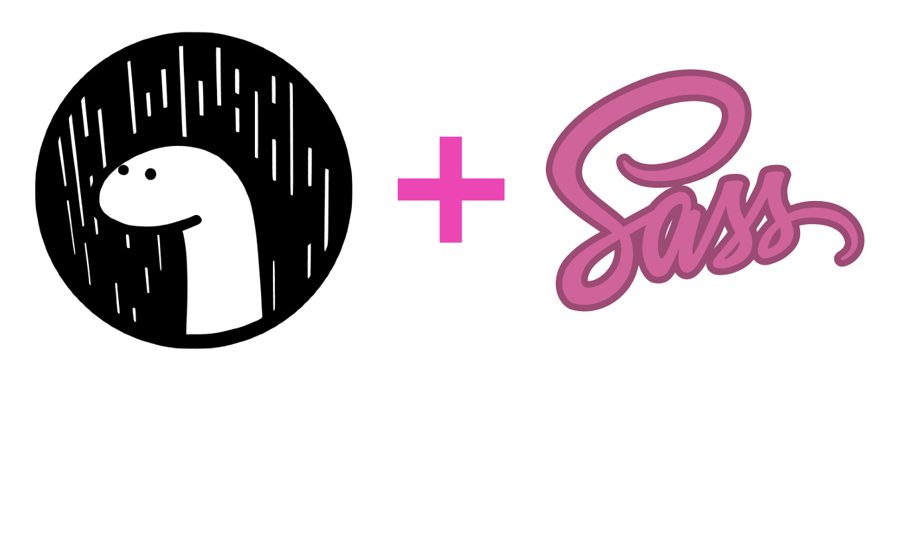

<br />
<p align="center">
  <a href="https://github.com/divy-work/deno_sass">
    
  </a>
  <h3 align="center">deno_sass</h3>

  <p align="center">
    High quality bindings to the sass_rs crate for Deno.
 </p>
 <p align="center">

  [](https://github.com/divy-work/deno_sass/stargazers)
  [](https://github.com/divy-work/deno_sass/issues)
  
  [](https://velociraptor.run)
 
 </p>
</p>

> 🌀 The library is not yet available on Windows. Expect breaking changes.


## Example

```typescript
import { compile } from "https://x.nest.land/sass@0.2.0/mod.ts";

compile("a { color: #000; }", {
  output_style: "nested",
  precision: 5,
  indented_syntax: false,
  include_paths: []
}).result;
```

#### Join Discord

[](https://discord.gg/uqywa4W)

## Building from source

### Prerequisites

- [deno](https://deno.land/)
- [rust](https://www.rust-lang.org/)

## Building
```bash
$ cargo build
```

## Example

```bash
$ deno run --unstable -A examples/compile.ts
```

### Contribution

Pull request, issues and feedback are very welcome. Code style is formatted with `deno fmt` and commit messages are done following [Conventional Commits](https://www.conventionalcommits.org/en/v1.0.0/) spec.

## Copyright

deno_sass is licensed under the MIT license. Please see the [LICENSE](LICENSE) file.
